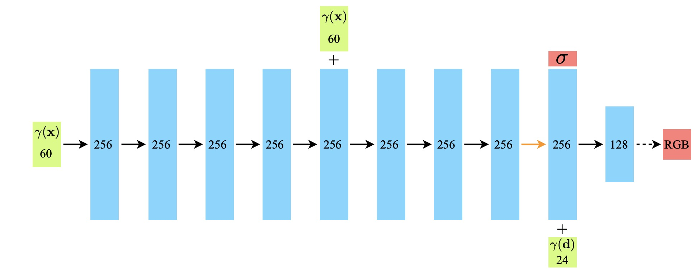

# 计算机图形学第二次大作业实验报告

## 王浩宇 计研三一 2022310841

### 算法原理

#### 神经辐射场与体渲染

神经辐射场是一个能表示3D场景的映射，接受3D空间点的坐标 $\boldsymbol{x}$ 与视角方向 $\boldsymbol{d}$ ，输出对应位置的体素密度 $\sigma$ 与颜色 $\boldsymbol{c}$ 。可以在包含多视角图像的训练集上训练神经网络学习这个映射。

渲染2D图像时，考虑相机发出的一条光线 $\boldsymbol{r}(t)=\boldsymbol{o}+t\boldsymbol{d}$ ，光线穿过有密度的物体时会发生衰减，我们记从 $\boldsymbol{r}(t)$ 到视点的衰减系数为   $T(t)=\exp{-\int_{0}^t\sigma(\boldsymbol{r}(s)){\rm d}s}$ 。对t进行积分，即可以得到像素点的颜色，即：

$$
C(\boldsymbol{x}, \boldsymbol{d})=\int_{0}^{+\infty}T(t)\sigma(\boldsymbol{r}(t))\boldsymbol{c}(\boldsymbol{r}(t), \boldsymbol{d}){\rm d}t
$$

离散地采样光线上的点之后进行求和，即可计算出像素点颜色的近似值。

#### 层次化分段随机采样

如果只在需要求积的区域均匀地采样多个点进行近似计算，可能会导致神经网络只需要学习一系列离散点的信息，从而使得最终生成的结果不够清晰。NeRF采用的是一种分段采样的方法，首先将射线需要积分的区域分为N份，然后在每一个小区域中进行均匀随机采样。这样的方式能够在只采样离散点的前提下，保证采样位置的连续性。

因为射线上的大部分区域，要么被遮挡，要么没有真实物体，对最终的颜色计算没有实际贡献，因此仅仅均匀分段随机采样是有些低效的。NeRF提出一种层次化采样方法，第一阶段粗采样是均匀分段随机采样，第二阶段称为细采样，将粗采样中每个采样点对颜色的贡献权重记为 $\omega_i$ 即：

$$
C(\boldsymbol{x}, \boldsymbol{d})=\sum_{i=1}^N\omega_i\boldsymbol{c}_i,\;\;\omega_i=T_i(1-e^{-\sigma_i\delta_i})
$$

将 $\omega_i$ 归一化，看作射线上点的分布的一种表示，根据这个概率分布再对射线进行采样，完成二阶段的细采样。

#### 位置信息编码

为了使神经网络能够学习到物体的高频信息，提升渲染效果，NeRF采用了一种与Transformer类似的编码方法，即采用正余弦函数变换，具体来说可表示为：

$$
\boldsymbol{\gamma}(p)= (\sin(2^0\pi p),\cos(2^0\pi p),\cdots,\sin(2^{L-1}\pi p),\cos(2^{L-1}\pi p))
$$

#### 网络结构

网络结构相对比较简单：多层MLP

#### 损失函数

原版NeRF采用L2损失作为损失函数，最小化粗采样结果和细采样结果对ground truth的差别，即：

$$
L_{RGB}=\frac{1}{|R|}\sum_{r\in R}||C(r)-\hat{C}(r)||_2
$$

其中$R$为在训练集图像上采样的光线。

InfoNeRF希望在fewshot的条件下，即不需要那么多视角的图片作为训练集的条件下得到相对不错的渲染效果，因此加入了光线的信息熵作为补充信息指导模型训练。信息熵损失扮演一个对射线正则化的角色，避免射线在fewshot条件下过拟合。光线的信息熵定义为：

$$
H(\boldsymbol{r}) = -\sum_{i = 1}^{N} p(\boldsymbol{x}_{i}) \log p(\boldsymbol{x}_{i}), \;\;p(\boldsymbol{x}_{i}) = \frac{1 - \exp(-\sigma_{i} \delta_{i})}{\sum_{j = 1}^{N} 1 - \exp(-\sigma_{j} \delta_{j})}
$$

信息熵较少的光线，几乎没有击中任何物体，因此可以丢弃，即 $Q(\boldsymbol{r})=\sum_{j = 1}^{N} 1 - \exp(-\sigma_{j} \delta_{j})$ 小于某阈值的光线。因此信息熵损失为：

$$
L_{entropy}=\frac{1}{|R|+|R_{entro}|}\sum_{r\in R\cup R_{entro}}I_{Q(\boldsymbol{r})>\epsilon}H(\boldsymbol{r})
$$

其中 $R_{entro}$ 为计算信息熵损失额外采样的光线，因为计算信息熵损失并不需要ground truth。

为保持视角的连续性，InfoNeRF还提出一个平滑损失函数，计算将光线进行一定偏移之后二者的便宜程度，即:

$$
L_{{KL}} := \sum_{i = 1}^{N} p(\boldsymbol{r}_{i}) \log \frac{p(\boldsymbol{r}_{i})}{p(\tilde{\boldsymbol{r}}_{i})}
$$

最终网络用于学习的损失为：

$$
L = L_{{RGB}} + \lambda_{entropy} L_{{entropy}} + \lambda_{KL} L_{{KL}}
$$

### 代码结构

代码的实现参考了[mjmjeong/InfoNeRF](https://github.com/mjmjeong/InfoNeRF)。

* `train.py`：实现了与模型训练相关的多个环节，包括参数解析`parse_config`、模型的构建`create_nerf`、光线粗采样与额外采样、模型保存与测试等。
* `render.py`：实现了与体渲染相关的多个函数，包括给定pose序列生成颜色和时差的`render_path`函数，渲染光束对应的颜色图、视差图的`render`函数，将神经网络的输出转换为颜色、时差、密度等的`raw2outputs`函数等。
* `loss.py`：实现了信息熵损失`EntropyLoss`类。
* `NeRF.py`：实现了NeRF神经网络模型。
* `load_blender.py`：实现如何导入数据，生成渲染视频的pose序列。
* `utils.py`：实现位置信息编码函数，以及计算MSE、PSNR、SSIM等的函数。

### 训练环境

* OS: `Ubuntu 20.04.5 LTS`
* GPU: `NVIDIA GeForce RTX 2080 Ti`
* CPU: `Intel(R) Xeon(R) CPU E5-2680 v4 @ 2.40GHz`
* 内存：128G
* `python 3.8.15; jittor 1.3.6.10; CUDA 11.0`

50000个iter需要训练约4个小时。

### 训练结果与分析

| Iter | Loss | PSNR | 渲染效果|
| ---- | ---- | ---- | ---- |
| 10000 | 0.021081 | 16.7610 | |
| 50000 | 0.014128 | 18.4991 | |

从渲染结果可以看出，经过50000轮训练，渲染效果相比10000轮训练时要好上很多，但细节上仍然存在不少失真或者模糊的地方，肉眼观测的效果与ground truth相比还是差不少，但这在仅仅四个视角的图片上训练的NeRF渲染得到的结果，相对来说还是有可取的意义的。
